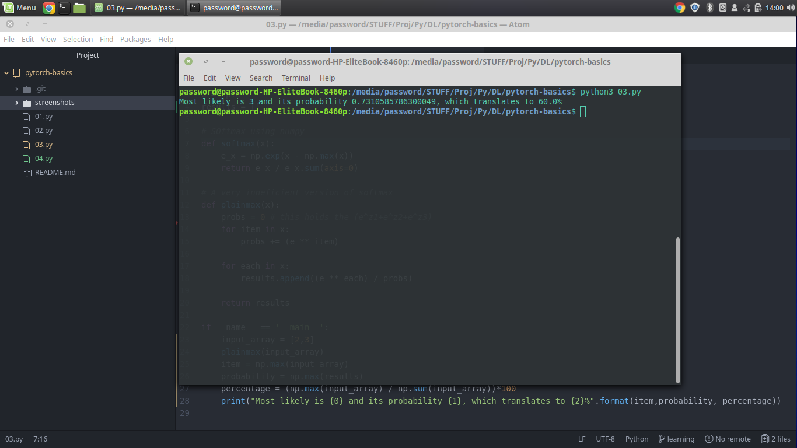

## ML Examples
This is the code I wrote learning machine learning on the Facebook Pytorch Challenge offered [here](https://classroom.udacity.com/nanodegrees/nd188/) on [Udacity](ssroom.udacity.com/me).

## 01.py
Perceptron code which uses a step function as the activation function.

## 02.py
Perceptron code which uses a sigmoid function as the activation function.

## 03.py
Perceptron still, but uses softmax as the activation function.
**Output**
```bash
  python3 03.py
  Most likely is 3 and its probability 0.7310585786300049, which translates to 60.0%
```

